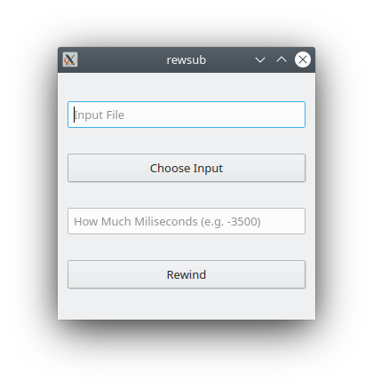

# Rewsub

Rewsub is a program for permanent movie-subtitle synchronization. Tested on Ubuntu 20.04

</img>

## Prerequisites

Pip - python package manager. Can be installed by:
```bash
sudo apt-get install python3-pip
```

PyQt5. Can be installed by:
    
```bash
pip3 install PyQt5
```

## Installation

1) Compile core.c as shared library:
  ```bash
  make clean
  make
  ```
2) Make rewsub.py executable:
  ```bash
  sudo chmod +x rewsub.py
  ```

## Usage

1) Run rewsub.py
2) Choose input file
3) Specify delay in miliseconds and press 'Rewind'

New file will have same path and name as input with prefix '_'.


## Licence

[GPL v3] (https://choosealicense.com/licenses/gpl-3.0/)
